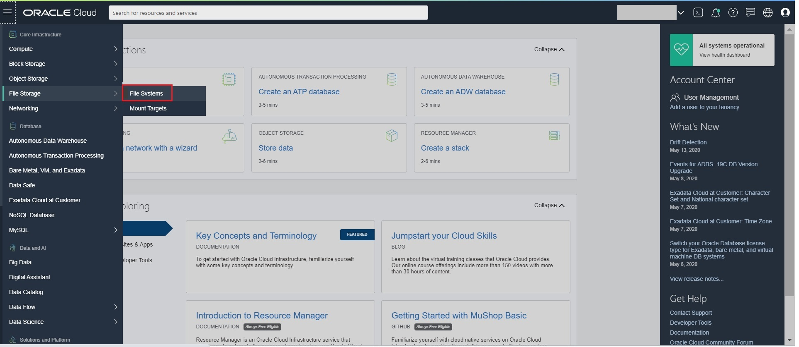

# Create Oracle Container Engine for Kubernetes (OKE) on Oracle Cloud Infrastructure (OCI) #

To create the File System Storage on OKE, follow the below steps:

In the Console, open the navigation menu. Under *Core Infrastructure*, go to *File Storage* and select **File Systems**.

On the File Storage page, select the Compartment and click **Create File System**.

You can create File System and Mount Targets with the default values. But here in case you want to rename the file System and mount targets, follow below steps. Note: Make Sure the *Virtual Cloud Network* in Mount Target refers to the one where your OKE Cluster is created and the *private subnet* from where you will be accessing this file system.

Edit and change the File System name to say *sharevolume*.  Next **Edit** and change the Mount Target name to sharevolume and make sure the Virtual Cloud Network selected is *soademo* (  and the Subnet as *oke_workers* ( i.e., subnet of the worker nodes)  the one which our  is using.
Click "Create"

Once the File System is created, it lands at below page. Click on "sharevolume" link.

Click on Mount Commands which gives details on how to mount this file system on your instances:

Mount Command pop up gives details on what must be configured on security list to access the mount targets from instances. Note down the mount command and Ingress/Egresss Rules which need to be added.

Note down the mount path and NFS server from the "COMMAND TO MOUNT THE FILE SYSTEM".
We will use this as NFS for Domain Home with below details. Sample from the above mount command.
NFS Server: 10.0.1.6
Mount Path: /sharevolume
Create the security list "fss_seclist" with below Ingress Rules as given in the Mount commands pop up

Create the Egress rules as below as given in the Mount commands pop up

Make sure to add the created security list "fss_seclist" to each subnets as shown below: Otherwise the created security list rules will not apply to the instances.